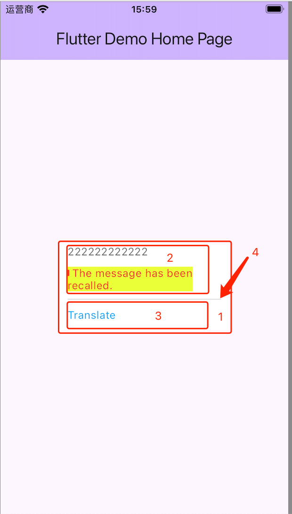
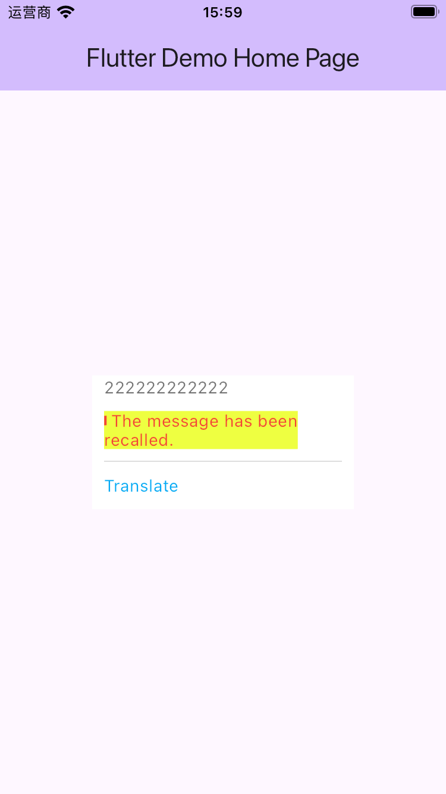

# flutter_rich_text_text_painter

[Related issue](https://github.com/flutter/flutter/issues/151301)

When using `TextPainter` to measure the width of `RichText`, setting `textWidthBasis` in `TextPainter` to `TextWidthBasis.longestLine` does not take effect.

## Requirements

### What the numbers mean

- Number 1 represents the container component
- Number 2 represents the main content component
- Number 3 represents the secondary content component
- Number 4 represents the divider component

### Constraints

1. The container component has a maximum width constraint, and also needs a MainAxisSize.min constraint
2. The width of the main content component and the secondary content component are different
3. The width of the divider component is calculated based on the largest width of the main content component and the secondary content component, and must meet the constraints of the container component.

## Implementation

Refer to [`lib/main.dart`](lib/main.dart)

## Issues

The width of the dividing line in the image should be equal to the width of the component with a yellow background, which does not comply with constraint 3.

## Improvements

**Are there any other alternatives?**
